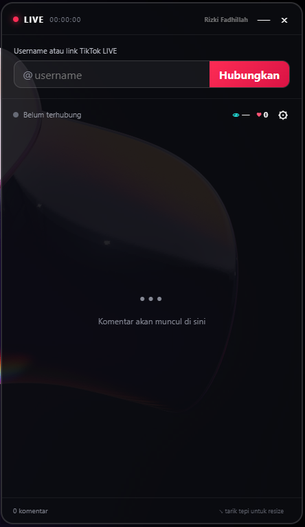

<div align="center">

# ⚡ LIVE CHAT OVERLAY
### *Next-Gen Floating TikTok Live Companion for Streamers & Gamers*

[](https://github.com/aidilfadilah99)
[](https://github.com/aidilfadilah99/live-chat-overlay/stargazers)
[](https://github.com/aidilfadilah99/live-chat-overlay)
[](https://electronjs.org/)

<p align="center">
  <b>Baca chat, pantau gift, dan sapa penonton TikTok LIVE langsung di atas layar game tanpa perlu monitor kedua!</b>
  <br />
  Ringan • Transparan • Anti-Ribet • Tanpa Login Akun
</p>

---

[Fitur Unggulan](#-fitur-unggulan) • 
[Preview Tampilan](#-preview-tampilan) • 
[Panduan Cepat](#-panduan-cepat) • 
[Mode Gamer (Click-Through)](#-mode-gamer--click-through) • 
[Instalasi Developer](#-instalasi--pengembangan) • 
[Author](#-author--kontak)

---

</div>

<br />

## 💡 Mengapa Menggunakan Live Chat Overlay?

Sebagai streamer atau content creator dengan setup monitor terbatas, berganti jendela (Alt+Tab) hanya untuk membaca chat TikTok sering kali mengganggu jalannya gameplay atau siaran.

**Live Chat Overlay** dirancang khusus untuk memecahkan masalah tersebut:
- 🚀 **Zero Login**: Tidak perlu input password, token, atau email TikTok. Cukup masukkan username host publik.
- 🎮 **Gamer Friendly**: Dilengkapi fitur *Click-Through (Tembus Klik)* sehingga cursor mouse tidak akan terhalang saat membidik atau mengklik game.
- 🪶 **Hemat Resource**: Menggunakan filter memori pintar yang membatasi histori chat agar konsumsi RAM dan CPU tetap minimal sepanjang sesi live stream.

<br />

---

## 🎯 Fitur Unggulan

| Kategori | Fitur & Deskripsi |
|---|---|
| 💬 **Live Interaction** | Komentar masuk secara *real-time* lengkap dengan avatar dan nama panggilan (@username). |
| 📊 **Real-time Analytics** | Ticker statistik live langsung: Jumlah penonton aktif saat ini, total likes, dan durasi live berjalan. |
| 👑 **Top Viewers & Joins** | Menampilkan 3 penonton teratas (top gifter/viewer) serta pop-up halus saat penonton baru bergabung. |
| 🎁 **Activity Feed** | Notifikasi interaksi khusus: Kiriman Gift & jumlah combonya, notifikasi Share, dan viewer yang baru Follow. |
| 🎨 **UI Kustomisasi Bebas** | Atur ukuran font (teks), transparansi latar (opacity), dan pilihan instan ukuran jendela (Kecil, Sedang, Besar). |
| 📌 **Always-On-Top Layer** | Jendela mengambang di atas semua aplikasi aktif, game *borderless*, maupun software OBS Studio. |

<br />

---

## 📸 Preview Tampilan

<div align="center">
  
  <p><i>Antarmuka minimalis, elegan, dan informatif saat sesi TikTok LIVE terhubung.</i></p>
</div>

<br />

---

## 🚀 Panduan Cepat

1. Pastikan akun TikTok yang ingin dipantau **sedang berlangsung (LIVE) dan berstatus publik**.
2. Masukkan username TikTok (contoh: `aidilfadilah` atau link live `https://www.tiktok.com/@aidilfadilah/live`).
3. Klik tombol **Hubungkan**.
4. Posisikan jendela di sudut layar yang nyaman bagi Anda, lalu aktifkan mode transparansi dan klik-tembus sesuai preferensi.

<br />

---

## 🎮 Mode Gamer / Click-Through

Fitur **Klik-Tembus (*Click-Through*)** memungkinkan Anda tetap menembakkan senjata di game atau mengklik desktop di area tepat di mana jendela chat berada tanpa sengaja menyeleksi jendela overlay.

> [!IMPORTANT]
> **Shortcut Darurat Pengendali Klik:**
> 
> Tekan kombinasi tombol:
> ### <kbd>Ctrl</kbd> + <kbd>Shift</kbd> + <kbd>X</kbd>
> 
> Pintasan ini berfungsi secara global di Windows untuk mengaktifkan atau mematikan mode klik-tembus kapan pun Anda ingin mengatur ulang posisi atau ukuran jendela.

<br />

---

## 🛠️ Instalasi & Pengembangan

Bagi developer yang ingin menjalankan atau memodifikasi kode sumber secara lokal:

### Prasyarat
- Sistem Operasi: **Windows 10 / 11**
- **Node.js**: Versi 20 ke atas
- Package Manager: **npm**

### Langkah Instalasi
```bash
# 1. Clone repository ini
git clone https://github.com/aidilfadilah99/live-chat-overlay.git

# 2. Masuk ke direktori proyek
cd live-chat-overlay

# 3. Install semua dependencies
npm install

# 4. Jalankan aplikasi dalam mode dev
npm start
```

> **Tips Windows:** Anda juga dapat langsung mengklik dua kali file `Jalankan.cmd` yang sudah disediakan di folder utama!

### 📦 Melakukan Build ke Portable Executable (.exe)
Untuk membuat file executable mandiri tanpa perlu terminal:
```bash
npm run pack
```
File biner portabel siap pakai akan otomatis terbuat di dalam direktori `dist/`.

<br />

---

## 📁 Struktur Kode

```text
live-chat-overlay/
├── src/
│   ├── main.js         # Process utama Electron, window manager, & TikTok connector
│   ├── preload.cjs     # Context bridge aman untuk komunikasi IPC (renderer <-> node)
│   ├── renderer.js     # Logika antarmuka UI, render chat feed, animasi, & event listener
│   ├── index.html      # Struktur visual aplikasi overlay
│   ├── styles.css      # Style utama (tema gelap modern & efek glassmorphism)
│   └── controls.css    # Style kontrol slider, tombol resize, & menu setting
├── docs/               # Dokumentasi & aset gambar
├── Jalankan.cmd        # Script launcher cepat untuk Windows
├── package.json        # Manifest proyek & konfigurasi electron-builder
└── README.md           # Dokumentasi resmi proyek
```

<br />

---

## ⚖️ Penafian (Disclaimer)

Aplikasi ini menggunakan modul pihak ketiga [`tiktok-live-connector`](https://www.npmjs.com/package/tiktok-live-connector) untuk membaca stream data Webcast publik.

- Proyek ini **tidak terafiliasi, dikelola, atau didukung secara resmi oleh TikTok atau ByteDance Inc.**
- Aplikasi ini murni bersifat *read-only* untuk siaran langsung publik dan **tidak pernah mengumpulkan, menyimpan, atau meminta kredensial/password akun pengguna.**
- Segala perubahan protokol atau kebijakan API dari platform TikTok dapat memengaruhi kestabilan koneksi.

<br />

---

## 👤 Author & Kontak

Dibuat & dikembangkan oleh:

**Aidil Fadilah**  
- 🌐 GitHub: [@aidilfadilah99](https://github.com/aidilfadilah99)
- 💼 Project Repository: [live-chat-overlay](https://github.com/aidilfadilah99/live-chat-overlay)

---

<div align="center">
  <b>Suka dengan project ini? Jangan lupa tinggalkan ⭐ Star di repositori GitHub!</b>
  <br /><br />
  <sub>Copyright © 2026 Aidil Fadilah. Crafted for creators & streamers.</sub>
</div>
